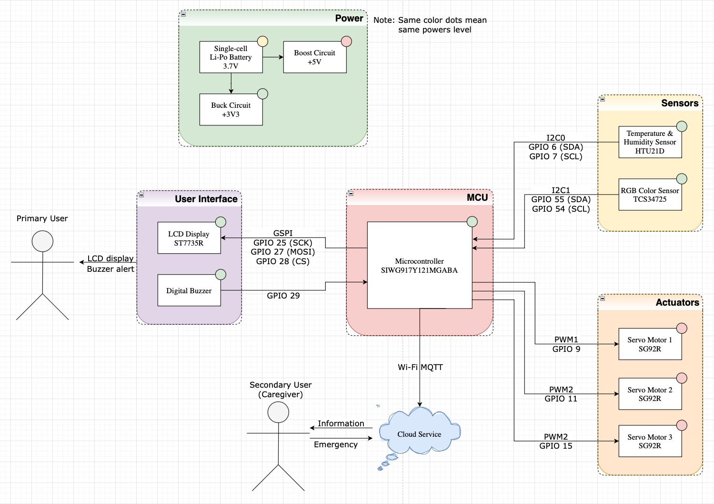
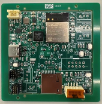
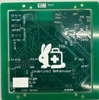
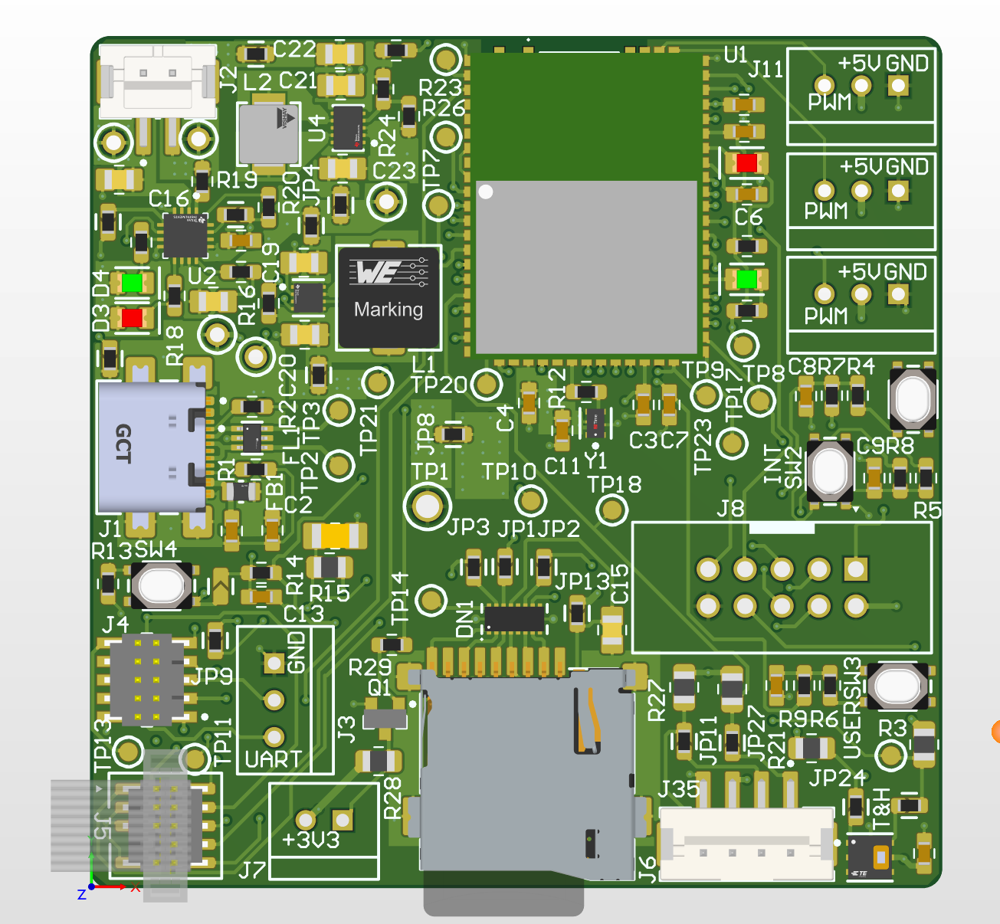

[](https://classroom.github.com/a/Y5lYn2wb)

# a11g-final-submission

**Team Number:** T28

**Team Name:** Undefined Behavior

| Team Member Name | Email Address          | GitHub Username |
| ---------------- | ---------------------- | --------------- |
| SHENGGE GUAN     | shengge@seas.upenn.edu | sysy6868        |
| HAORAN LIANG     | liang9@seas.upenn.edu  | H-control       |

**GitHub Repository URL:** https://github.com/ese5160/a11g-final-submission-s26-s26-t28-undefined-behavior.git

---

## 1. Video Presentation

[Video Presentation](https://drive.google.com/file/d/1SjETWYIJS-aHI5Vbsq0bubb_OEaW06ys/view?usp=drive_link)

---

## 2. Project Summary

### Device Description

Our project is a smart, Internet-connected pill dispenser that identifies pills as they are loaded, routes them into compartments, dispenses them on schedule or on demand, and alerts users when medication storage conditions are unsafe. It combines local sensing and actuation with a caregiver-facing Node-RED dashboard so medication events, inventory state, environmental data, and OTA firmware updates can be managed remotely.

**Inspiration.** Traditional pill boxes and phone alarms still depend on the patient remembering which pill to take and whether the box was loaded correctly. For elderly users or patients taking multiple medications, missed doses, wrong-pill events, and lack of caregiver visibility can become serious safety risks. Our prototype reduces manual sorting and gives a secondary user, such as a caregiver, a remote way to monitor and trigger medication actions.

**Internet functionality.** The device connects to an MQTT broker running on an Azure VM and communicates with a Node-RED dashboard. The dashboard can send immediate dispense commands, add daily dispense schedules, configure temperature/humidity thresholds, refresh device state, trigger OTA firmware updates, and restart the system. The device publishes load events, dispense events, inventory snapshots, temperature/humidity telemetry, environmental warnings, command acknowledgements, Wi-Fi status, and OTA status back to the cloud.

### Device Functionality

We use a MCU, Silicon Labs **SIWG917Y121MGABA** Wi-Fi MCU, to run the main FreeRTOS application, system state machine, Wi-Fi/MQTT communication, OTA update flow, display control, buzzer control, environmental sensing, and servo actuation. Our color-sensing subsystem reads the **TCS34725 RGB color sensor** over I2C, learns up to three pill-color signatures, classifies the current pill, and outputs a 2-bit color code to the primary MCU. This split was used because the final system was more reliable when the color-sensor sampling/classification loop was isolated from the timing-sensitive Wi-Fi, LCD, and actuator logic on the primary MCU.

| Subsystem | Implementation |
| --- | --- |
| System control | SIWG917Y121MGABA running the main FreeRTOS medication-dispenser firmware |
| Color sensing | TCS34725 RGB color sensor; classifies learned pill colors as `COLOR_0`, `COLOR_1`, or `COLOR_2` |
| Environmental sensing | HTU21D temperature/humidity sensor on I2C0, default sample period 10 s |
| Display | ST7735R LCD over software SPI/GSPI-style GPIO interface |
| Audio alert | Active digital buzzer on GPIO29 |
| Actuation | Three SG92R/SG90-class servos: loading release, compartment rotation, and dispensing release |
| Cloud | Node-RED dashboard on Azure VM using MQTT topics such as `ese5160/dispense/set`, `ese5160/config/set`, `ese5160/ota/update`, and `ese5160/pill/event` |
| OTA | HTTPS OTA firmware update from Azure Blob Storage, triggered from Node-RED |
| Power | Single-cell 3.7 V Li-Po battery with 5 V boost rail and 3.3 V buck rail |


#### Main firmware architecture

The primary MCU firmware is organized as a task-based system rather than a single blocking loop:

```text
Sensor Task  -> q_sensor_evt      -> System Control Task -> q_actuator_cmd -> Actuator Task
Wi-Fi Task   -> q_schedule_update -> System Control Task -> q_wifi_evt     -> Wi-Fi/MQTT Publish
Node-RED OTA -> q_ota_cmd         -> OTA Task
```

- `task_sensor` samples HTU21D temperature/humidity and reads the 2-bit color code from the secondary color MCU.
- `task_sys_control` owns the system FSM, loading FSM, dispensing FSM, inventory bookkeeping, duplicate-command filtering, and fault handling.
- `task_actuator` executes servo, LCD, and buzzer commands.
- `task_wifi` manages Wi-Fi, MQTT subscriptions, JSON command parsing, command acknowledgement, and MQTT publishing.
- `task_ota` performs the blocking HTTPS OTAF update only when the dispenser is idle, then reports status and soft-resets the SoC.

#### System-level block diagram




### Challenges

**1. Full-system integration across sensing, actuation, display, and Wi-Fi.** Individual subsystems worked in isolation, but timing problems appeared after combining servo control, LCD refresh, MQTT traffic, HTU21D sampling, color detection, and OTA support. We addressed this by restructuring the application into FreeRTOS tasks with message queues, so each subsystem has a clear responsibility and no task directly controls another subsystem's hardware.

**2. Color sensing reliability.** The color sensor needed stable readings while pills were physically moving. The MCU takes an empty baseline, waits for a stable object, normalizes RGB values using the clear channel, compares the result against learned signatures, and outputs the results.

**3. Cloud command robustness.** Early MQTT commands were simple single-byte payloads, which were useful for bring-up but fragile for a dashboard. The final Wi-Fi task supports JSON commands, validates payload length and fields, rejects malformed commands, sends command acknowledgements, and filters duplicate dispense IDs to avoid accidental double-dispensing from dashboard retries.

**4. OTA update timing.** OTA firmware updates are blocking and should not run while a pill is being loaded or dispensed. We isolated OTA into its own task and check the system state before starting the update. If the device is busy, the firmware reports a busy status instead of silently ignoring the command.

**5. PCB and bring-up constraints.** Pin assignments, I2C bus choices, servo PWM pins, and power rail behavior became fixed constraints once the board was assembled. We used incremental bring-up, serial logs, and logic-analyzer checks to verify buses and GPIO levels before integrating each new feature.

### Prototype Learnings

This prototype reinforced that an IoT device is not just a collection of peripherals. It is a timing-sensitive system where mechanical motion, power stability, bus protocols, firmware state, and cloud messaging all interact. The most useful engineering practice was incremental validation: verify one sensor, one actuator, one MQTT path, and one display update before combining them.

If we built the device again, we would reserve more GPIO and bus headroom, design the pill path and electronics enclosure as separable modules, include more test points on the PCB, add persistent local event storage for offline operation, and start the Node-RED/OTA pipeline earlier so cloud behavior and firmware behavior evolve together.

### Next Steps & Takeaways

To make this prototype closer to a deployable product, the next steps are:

1. Improve the mechanical pill path so single-pill release is repeatable across pill sizes and shapes.
2. Add persistent nonvolatile logging so events generated while offline can be synchronized after reconnection.
3. Add stronger pill-identification validation, such as calibration mode, reject-bin behavior, or a higher-confidence color model.

Through ESE5160, we gained hands-on experience with the full IoT edge stack: PCB design, board bring-up, embedded C, RTOS task design, I2C/SPI/GPIO/PWM peripherals, Wi-Fi, MQTT, Node-RED dashboards, Azure deployment, OTA firmware updates, and requirements-based validation.

### Project Links

- **Node-RED Dashboard UI:** http://20.242.49.27:1880/ui
- **Node-RED Dashboard:** http://20.242.49.27:1880
- **Altium 365 PCBA Share Link:** https://upenn-eselabs.365.altium.com/designs/E257A941-13C5-4D36-81FD-153506AD2CFA#design

---

## 3. Hardware & Software Requirements

The tables below review the original hardware and software requirements against the final prototype. The status column is intentionally specific: **Met** means the final integrated prototype demonstrated the requirement; **Partial** means the prototype contains a working implementation but is missing a production-level feature or complete validation data.

### 3.1 Hardware Requirements (HRS)

| ID | Requirement | Status | Validation Evidence |
| --- | --- | --- | --- |
| HRS01 | The system shall include a primary SIWG917Y121MGABA microcontroller for system state control, sensor processing, actuator control, and wireless communication. | Met | Main firmware boots on the SiWG917Y platform and starts `task_sensor`, `task_sys_control`, `task_actuator`, `task_wifi`, and `task_ota`. Serial output shows the firmware version and `all tasks started`. |
| HRS02 | The hardware shall support wireless data transmission to a cloud service for event reporting and alert notification. | Met | The primary MCU connects over Wi-Fi and publishes MQTT messages to the Azure-hosted Node-RED/Mosquitto service. Node-RED receives device events on `ese5160/pill/#`. |
| HRS03 | An RGB color sensor shall be used to identify pills by color as they are loaded. | Met | The secondary color MCU reads the TCS34725 RGB sensor at address `0x29`, normalizes RGB readings, learns up to three color signatures, and outputs a classified 2-bit code. |
| HRS04 | The color-sensing subsystem shall distinguish the different pill colors used in the prototype. | Met | The secondary MCU maps stable learned colors to `COLOR_0`, `COLOR_1`, and `COLOR_2`; the primary MCU debounces the received code before starting a loading sequence. Add your final calibration photo/video frame here if available. |
| HRS05 | A sorting actuator shall route each loaded pill into the compartment associated with its detected color. | Met | The primary MCU maps detected color to compartment and commands the compartment-rotation servo plus loading-release servo through the actuator task. |
| HRS06 | A dispensing actuator shall release pills from a selected compartment when commanded by schedule or dashboard. | Met | The dispensing FSM checks inventory, rotates to the requested compartment, drives the dispensing-release servo, updates inventory, sounds the take-pill alert, and publishes a dispense event. |
| HRS07 | If a pill color is invalid or unmapped, the system shall generate an error instead of loading it as a normal pill. | Partial | The main FSM includes fault paths for invalid mapping/selection and publishes fault events. The color subsystem currently classifies the first three learned colors and outputs `NONE` when no valid object is present; a production reject-bin mechanism is not implemented. |
| HRS08 | The hardware shall support OTA firmware update over Wi-Fi. | Met | The primary MCU includes HTTPS OTAF support and can download `firmware/latest.rps` from Azure Blob Storage after a Node-RED OTA command. |
| HRS10 | A buzzer shall provide audible alerts for environmental warnings and medication-error conditions. | Met | GPIO29 controls an active buzzer. Firmware implements boot, environmental warning, take-pill, fault, and OTA-done buzzer patterns. |
| HRS11 | A visual display shall present current state and dispensing information to the user. | Met | ST7735R LCD shows temperature/humidity, Wi-Fi status, inventory indicators, loading/dispensing overlays, faults, and OTA status. |
| HRS13 | A temperature/humidity sensor shall monitor environmental conditions inside the dispenser. | Met | HTU21D is connected on I2C0 using GPIO6/GPIO7 and sampled by `task_sensor` at a configurable period. |
| HRS14 | When temperature or humidity exceeds safe thresholds, the system shall generate an environmental warning. | Met | Default thresholds are 0-30 degC and 0-60% RH. Node-RED can update the thresholds; firmware generates temp/humidity warning and normal events on threshold crossings. |
| HRS15 | The system shall be powered by a single-cell 3.7 V Li-Po/Li-ion battery. | Met | Power block uses a single-cell battery as the input source. Add final measured battery input voltage here if available. |
| HRS16 | The hardware shall include power regulation circuitry to support stable 5 V and 3.3 V rails. | Met | Block diagram and PCB design include a boost circuit for 5 V and buck circuit for 3.3 V. Add final measured rail voltages under load here if available. |

### 3.2 Software Requirements (SRS)

| ID | Requirement | Status | Validation Evidence |
| --- | --- | --- | --- |
| SRS01 | On power-up/reset, the system shall initialize required software modules and hardware interfaces. | Met | `app_init()` calls `pill_rtos_init()`, which creates queues/mutexes and starts all application tasks; actuator, sensor, Wi-Fi, OTA, and system-control tasks initialize their respective subsystems. |
| SRS02 | The system shall operate using a state-based control model including Idle, Dispensing, Monitoring, and Error/Fault behavior. | Met | `task_sys_control` implements `INIT`, `IDLE`, `LOAD_SUB`, `DISPENSE_SUB`, and `FAULT`, with loading and dispensing sub-FSMs. Monitoring runs through the sensor task while system state is maintained by the control task. |
| SRS03 | The system shall store and manage medication schedules. | Met | Node-RED provides an "Add daily schedule" UI using cron scheduling in America/New_York and publishes scheduled JSON dispense commands to the MCU. |
| SRS04 | At each scheduled medication time, the system shall initiate dispensing. | Met | The Node-RED schedule emits `{"cmd":"dispense","compartment":...}` to `ese5160/dispense/set`; the MCU parses the command and starts the dispensing FSM if the slot is valid and not busy. |
| SRS05 | The system shall provide medication reminder alerts through audio and visual feedback. | Met | The actuator task displays `TAKE PILL` and plays the take-pill buzzer pattern after a successful dispense. |
| SRS06 | During pill loading, the system shall sample color data and compare it against configured/learned profiles. | Met | The secondary MCU samples TCS34725 RGBC data, waits for a stable object, normalizes RGB values, and matches or stores learned signatures. The primary MCU consumes the resulting stable color code. |
| SRS07 | If a pill does not match a valid configured profile, the system shall enter an error/fault path and alert the user. | Partial | The primary FSM has fault paths and user alerts. Final hardware does not yet include a separate mechanical reject path for an unknown pill. |
| SRS13 | The system shall periodically sample temperature and humidity. | Met | HTU21D is sampled every 10 s by default; the sample interval can be configured from Node-RED between 1 s and 600 s. |
| SRS14 | When temperature or humidity exceeds user-configurable thresholds, the system shall warn the user. | Met | Node-RED sends `config` JSON with threshold values; firmware updates runtime thresholds, publishes config acknowledgements, and triggers environmental warning events and buzzer alerts on threshold crossings. |
| SRS16 | The display shall update current system status, dispensing activity, and warnings. | Met | LCD layers show base temperature/humidity, Wi-Fi status, inventory, transient overlays, fault messages, and OTA status. |
| SRS17 | The system shall log dispensing events, sorting errors, and environmental warnings with timestamps. | Partial | The device publishes all event types through MQTT; Node-RED displays/logs them and adds dashboard-side time context. The MCU itself does not include a real-time clock or persistent timestamped event store. |
| SRS18 | When network connectivity is available, the system shall upload logged events to the cloud. | Met | Wi-Fi/MQTT task publishes load, dispense, inventory, environmental, fault, command-status, and OTA events to the cloud dashboard while connected. |
| SRS19 | When network connectivity is unavailable, the system shall continue local operation and synchronize stored events once connectivity is restored. | Partial | Local state machine, sensing, display, buzzer, and actuation can continue without cloud commands. Full persistent offline event buffering and later backfill synchronization are not yet implemented. |
| SRS20 | The system shall accept dispense commands from the Node-RED dashboard. | Met | Manual dashboard buttons publish JSON dispense commands for compartments A/B/C; the firmware validates payloads, rejects invalid/busy/empty requests, and reports command status. |
| SRS21 | The system shall accept schedule and temperature/humidity threshold updates from Node-RED. | Met | Schedule management is implemented in Node-RED, and runtime environmental thresholds/sample interval are sent to the MCU through `ese5160/config/set`. |
| SRS22 | The system shall support OTA firmware updates over Wi-Fi. | Met | Node-RED OTA button publishes an OTA command; `task_wifi` forwards it to `task_ota`, which runs HTTPS OTAF from Azure Blob Storage and soft-resets the SoC after success. |

---

## 4. Project Photos & Screenshots

> Replace any placeholder filenames below with the final images committed under `image/README/`. The assignment requires high-quality photos/screenshots, so do not leave this section as a bullet list without images.


### Standalone PCBA - Top







### Node-RED Dashboard


### Node-RED Backend Flow


### System-Level Block Diagram


---

## 5. Codebase

- **Embedded C Firmware:** https://github.com/ese5160/final-project-firmware-s26-t28-undefined-behavior/code_final
- **Node-RED dashboard code:** https://github.com/ese5160/final-project-firmware-s26-t28-undefined-behavior/tree/code_final/final_medication/Node_RED


---

## Final Submission Checklist

Before submitting, verify the following:

- [ ] Replace the Google Drive video link with the required public YouTube link, or confirm the teaching team accepts the Drive link.
- [ ] Add final team member names if required by your GitHub Pages site or video description.
- [ ] Commit `image/README/block_diagram.png` using the block diagram shown in the final submission.
- [ ] Add final integrated prototype photo.
- [ ] Add PCBA top and bottom photos.
- [ ] Add Node-RED dashboard screenshot.
- [ ] Add Node-RED backend/flow screenshot.
- [ ] Add measured 3.3 V and 5 V rail values if available.
- [ ] Add any final validation data screenshots/log snippets you want the graders to see.
- [ ] Confirm the Node-RED dashboard URL is live on the Azure VM during grading.
- [ ] Confirm no private Wi-Fi credentials, secrets, or passwords are committed in the public repository.
