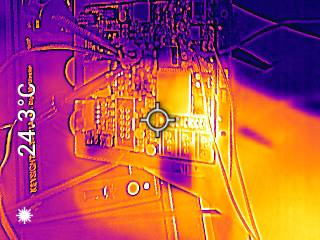
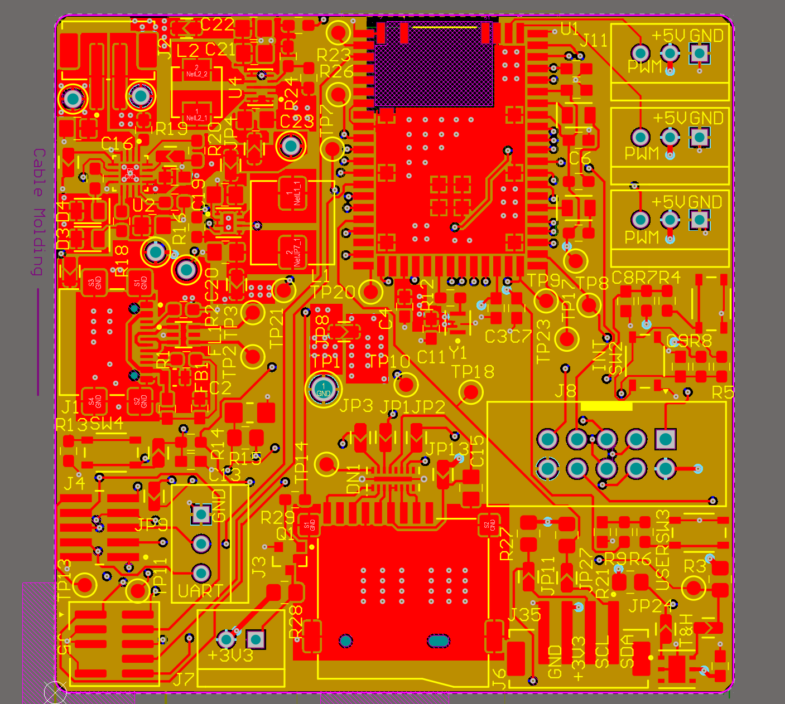

# a11g-final-submission

**Team Number:** T28

**Team Name:** Undefined Behavior

| Team Member Name | Email Address          | GitHub Username |
| ---------------- | ---------------------- | --------------- |
| SHENGGE GUAN     | shengge@seas.upenn.edu | sysy6868        |
| HAORAN LIANG     | liang9@seas.upenn.edu  | H-control       |

**GitHub Repository URL:** https://github.com/ese5160/a11g-final-submission-s26-s26-t28-undefined-behavior.git

---

## 1. Video Presentation

[https://drive.google.com/file/d/1SjETWYIJS-aHI5Vbsq0bubb_OEaW06ys/view?usp=drive_link]

---

## 2. Project Summary

### Device Description

A smart, Internet-connected pill dispenser. As pills are loaded, an RGB color sensor automatically identifies each one by color and routes it into the correct compartment. Pills can then be dispensed on a user-configured schedule, or on demand from a Node-RED cloud dashboard. The device also monitors the storage temperature and humidity, sounding a buzzer when readings exceed user-configurable thresholds, and supports over-the-air firmware updates.

**Inspiration.** Pill boxes, phone alarms, and reminder apps still rely on the user's memory. For elderly users on multiple prescriptions, missed doses and wrong pills are common and dangerous. Our device removes the manual sorting step entirely and gives caregivers remote control over dispensing.

**Internet functionality.** Through the Node-RED dashboard, caregivers can trigger an immediate dispense, edit the daily dispensing schedule, set the temperature/humidity alert thresholds, and view live environmental data. The device pushes every dispensing event and environmental warning back to the cloud, and accepts firmware updates over the air.

### Device Functionality

The device is built around a **Silicon Labs SIWG917Y121MGABA** Wi-Fi MCU, which runs the state machine, talks to all peripherals, and connects to the cloud.

- **Sensors:** RGB color sensor (I²C) — identifies each pill by color during loading; temperature & humidity sensor (I²C) — monitors storage environment
- **Actuators:** SG90 servo (PWM) — routes incoming pills into the correct compartment; motor + TB6612FNG driver (PWM) — dispenses pills from the selected compartment; buzzer (PWM) — sounds when environmental thresholds are exceeded; LCD (I²C) — shows current state
- **Power:** 3.7 V Li-ion → 5 V boost → 3.3 V buck
- **Connectivity:** Wi-Fi to Node-RED on Azure — cloud-triggered dispensing, schedule editing, threshold configuration, and OTA firmware updates

#### System-Level Block Diagram

### Challenges

The hardest part of this project was **system integration**. Each subsystem worked fine on its own, but combining them onto one MCU surfaced problems that didn't show up in unit tests:

**Concurrent task scheduling.** Sensor sampling, PWM control, LCD refresh, and Wi-Fi uploads all had to run together without interfering with the dispensing cycle.

**End-to-end timing with Node-RED.** Aligning event payloads and timing between the MCU, Wi-Fi, and the dashboard took several iterations.

We resolved these by integrating one peripheral at a time and using the Saleae logic analyzer plus serial logs to verify each step before adding the next.

### Prototype Learnings

Building this prototype taught us that planning the integration is as important as designing each subsystem. Early decisions — pin assignments, I²C addressing, power budget, mechanical clearances — locked in constraints we kept hitting weeks later during firmware bring-up. We also learned the value of incremental validation: bringing up one peripheral at a time with the logic analyzer caught issues that would have been nearly impossible to debug after full integration. If we built this device again, we would reserve more spare GPIO/bus headroom on the PCB, separate the dispensing mechanics from the electronics enclosure to simplify rework, and start the Node-RED + OTAFU pipeline earlier so cloud and firmware co-evolve instead of being stitched together at the end.

### Next Steps & Takeaways

To turn this prototype into a real product, the next steps are: tighter mechanical design for reliable single-pill dispensing, a proper enclosure with sealed compartments, longer battery life via low-power sleep modes between events, and a hardened OTAFU flow with rollback. ESE5160 gave us hands-on experience across the full IoT stack — schematic capture and PCB layout in Altium, embedded C driver development, RTOS-style task scheduling, Wi-Fi and MQTT, Node-RED dashboards on Azure, and OTA firmware updates — and tied it all together with the engineering discipline of writing requirements first and validating against them at the end.

### Project Links

- **Node-RED dashboard (Azure):**
- **Altium 365 PCBA share link: https://upenn-eselabs.365.altium.com/designs/E257A941-13C5-4D36-81FD-153506AD2CFA#design**

---

## 3. Hardware & Software Requirements

### 3.1 Hardware Requirements (HRS)

#### Core Control and Connectivity

| ID    | Description                                                                                                                                                       | Status / Validation |
| ----- | ----------------------------------------------------------------------------------------------------------------------------------------------------------------- | ------------------- |
| HRS01 | The system shall be based on the SIWG917Y121MGABA microcontroller for system state control, sensor data processing, actuator control, and wireless communication. | Met                 |
| HRS02 | The hardware shall support wireless data transmission to a cloud service for event reporting and alert notification.                                              | Met                 |
| HRS08 | The hardware shall support over-the-air (OTA) firmware update via Wi-Fi.                                                                                          | Met                 |

#### Medication Sorting and Dispensing

| ID    | Description                                                                                                                                                    | Status / Validation |
| ----- | -------------------------------------------------------------------------------------------------------------------------------------------------------------- | ------------------- |
| HRS03 | An RGB color sensor shall be used to identify each pill by color as it is loaded into the device.                                                              | Met                 |
| HRS04 | The color sensor shall be capable of reliably distinguishing between the different pill colors used in the device.                                             | Met                 |
| HRS05 | A sorting actuator (servo) shall route each loaded pill into the compartment associated with its detected color.                                               | Met                 |
| HRS06 | A dispensing actuator (motor + driver) shall release pills from a selected compartment when commanded by the schedule or by the cloud dashboard.               | Met                 |
| HRS07 | If a pill's color does not match any of the configured pill types, the system shall generate an error event and not route the pill into a regular compartment. | Met                 |

#### User Indication

| ID    | Description                                                                                                  | Status / Validation |
| ----- | ------------------------------------------------------------------------------------------------------------ | ------------------- |
| HRS10 | A buzzer shall be used to provide audible alerts for environmental warnings and medication-error conditions. | Met                 |
| HRS11 | A visual display (LCD) shall be used to present current system state and dispensing information to the user. | Met                 |

#### Environmental Monitoring

| ID    | Description                                                                                                                | Status / Validation |
| ----- | -------------------------------------------------------------------------------------------------------------------------- | ------------------- |
| HRS13 | A temperature and humidity sensor shall be used to monitor environmental conditions inside the medication dispenser.       | Met                 |
| HRS14 | When temperature or humidity exceeds predefined safe thresholds, the system shall generate an environmental warning event. | Met                 |

#### Power System

| ID    | Description                                                                                                             | Status / Validation |
| ----- | ----------------------------------------------------------------------------------------------------------------------- | ------------------- |
| HRS15 | The system shall be powered by a single-cell 3.7 V Li-ion battery.                                                      | Met                 |
| HRS16 | The hardware shall include power regulation circuitry to support stable system operation across battery voltage ranges. | Met                 |

### 3.2 Software Requirements (SRS)

#### System Initialization and State Management

| ID    | Description                                                                                                                                                                     | Status / Validation |
| ----- | ------------------------------------------------------------------------------------------------------------------------------------------------------------------------------- | ------------------- |
| SRS01 | Upon power-up or reset, the system shall initialize all required software modules and hardware interfaces, including sensors, actuators, display, and communication subsystems. | Met                 |
| SRS02 | The system shall operate using a state-based control model, including at minimum Idle, Dispensing, Monitoring, and Error states.                                                | Met                 |

#### Medication Scheduling and Dispensing Logic

| ID    | Description                                                                                                                                                | Status / Validation |
| ----- | ---------------------------------------------------------------------------------------------------------------------------------------------------------- | ------------------- |
| SRS03 | The system shall store and manage medication schedules, including dispensing time, expected medication identifier, and associated compartment information. | Met                 |
| SRS04 | At each scheduled medication time, the system shall initiate the dispensing process by actuating the medication dispensing mechanism.                      | Met                 |
| SRS05 | The system shall provide a medication reminder to the user through audio and visual alerts during dispensing.                                              | Met                 |

#### Pill Sorting and Identification

| ID    | Description                                                                                                                                                                     | Status / Validation |
| ----- | ------------------------------------------------------------------------------------------------------------------------------------------------------------------------------- | ------------------- |
| SRS06 | During pill loading, the system shall sample data from the color sensor and compare the detected color against the configured pill-color profiles.                              | Met                 |
| SRS07 | If a pill's color does not match any configured profile, the system shall enter an error state, withhold the pill from the regular compartments, and generate an audible alert. | Met                 |

#### Environmental Monitoring

| ID    | Description                                                                                                                            | Status / Validation |
| ----- | -------------------------------------------------------------------------------------------------------------------------------------- | ------------------- |
| SRS13 | The system shall periodically sample temperature and humidity data from the environmental sensor.                                      | Met                 |
| SRS14 | When the temperature or humidity exceeds user-configurable thresholds, the system shall generate a warning event and sound the buzzer. | Met                 |

#### User Interaction

| ID    | Description                                                                                                                    | Status / Validation |
| ----- | ------------------------------------------------------------------------------------------------------------------------------ | ------------------- |
| SRS16 | The system shall update the display to reflect current system status, dispensing activity, and error or warning notifications. | Met                 |

#### Cloud Communication and Data Logging

| ID    | Description                                                                                                                                      | Status / Validation |
| ----- | ------------------------------------------------------------------------------------------------------------------------------------------------ | ------------------- |
| SRS17 | The system shall log all dispensing events, sorting errors, and environmental warnings with time stamps.                                         | Met                 |
| SRS18 | When network connectivity is available, the system shall upload logged events to the cloud.                                                      | Met                 |
| SRS19 | When network connectivity is unavailable, the system shall continue local operation and synchronize stored events once connectivity is restored. | Met                 |
| SRS20 | The system shall accept dispensing commands issued from the Node-RED dashboard and dispense from the requested compartment immediately.          | Met                 |
| SRS21 | The system shall accept updates to the dispensing schedule and to temperature/humidity thresholds issued from the Node-RED dashboard.            | Met                 |
| SRS22 | The system shall support over-the-air (OTA) firmware updates delivered over Wi-Fi.                                                               | Met                 |

---

## 4. Project Photos & Screenshots

* The standalone PCBA, top
* The standalone PCBA, bottom
* Thermal camera images while the board is running under load (you may use your Board Bringup Thermal image here!)
* The Altium Board design in 2D view (screenshot) 
* The Altium Board design in 3D view (screenshot) 
* Node-RED dashboard (screenshot)
* Node-RED backend (screenshot)
* Block diagram of your system (You may need to update this to reflect changes throughout the semester.)

**

---

## 5. Codebase

Per the assignment, source code is **not** committed to this repo — only links.

- **Embedded C firmware (Si91x):**
- **Node-RED dashboard / flow export:**
- **Other software / scripts:**
